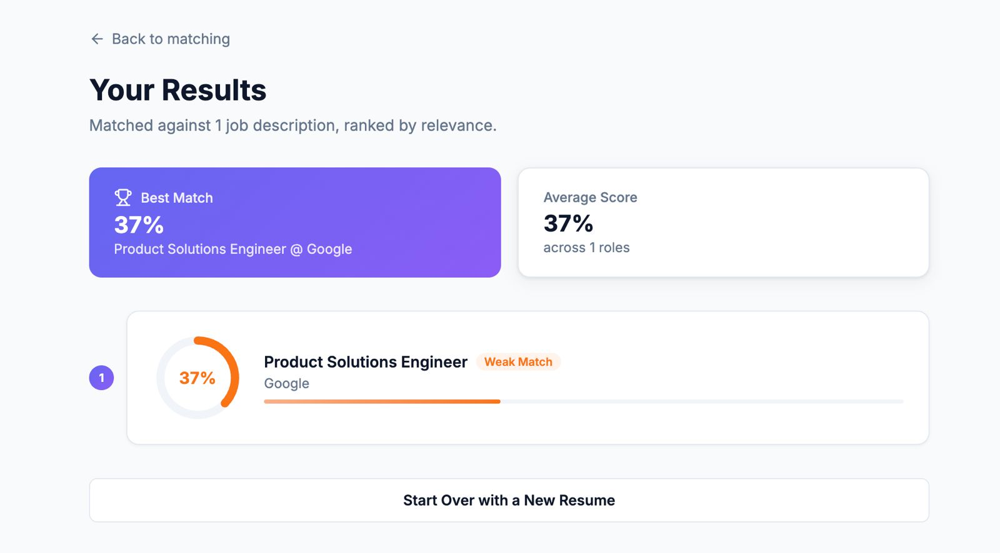

# Resume Intelligence Platform

An AI-powered platform that semantically matches resumes to job descriptions using sentence transformers and cosine similarity scoring.

**Live App:** [https://resume-intelligence-ui.vercel.app ](https://resume-ai-interface.vercel.app/) 

**API Docs:** https://your-render-url.onrender.com/docs

---

## Screenshot

## What It Does

- Upload a resume PDF — text is extracted and stored automatically
- Add job descriptions from any JD text
- Match your resume against a single JD and get a semantic similarity score
- Bulk match your resume against up to 20 JDs at once, ranked by relevance
- View full match history for any candidate

---

## Tech Stack

| Layer | Technology |
|---|---|
| API | FastAPI, Pydantic |
| Database | PostgreSQL, SQLAlchemy 2.0, Alembic |
| AI / ML | sentence-transformers (all-MiniLM-L6-v2), scikit-learn |
| PDF Parsing | pdfplumber |
| Testing | pytest, pytest-cov, pytest-asyncio |
| CI/CD | GitHub Actions |
| Containerization | Docker, Docker Compose |
| Deployment | Render (backend), Vercel (frontend) |

---

## Architecture
